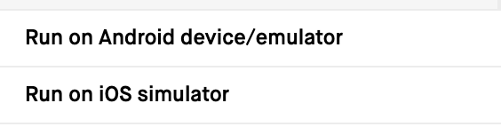
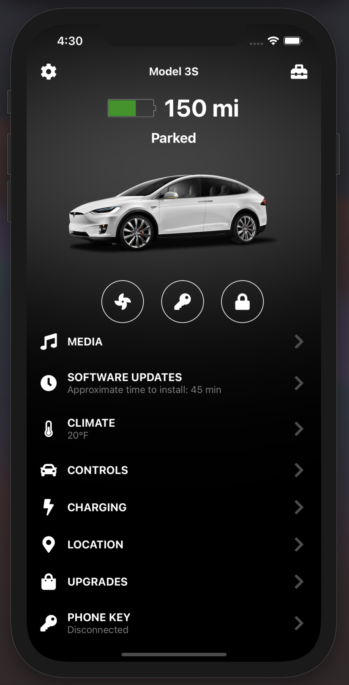

# Tesla App
Clone built using React-Native and Javascript.
<br></br>

### Getting Started
 - Configure project using:
   ```bash
   yarn install
   ```
 - Run project using:
   ```bash
   yarn start
   ```
 - Choose the device to run on from browser window:
 
 - Voila!

### Screenshot
<br>
<p align="center">
    
</p>
